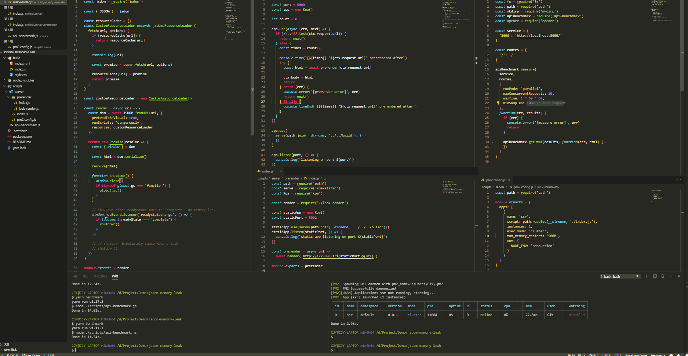

# JSDOM memory leak demo

## Issues

https://github.com/jsdom/jsdom/issues/2741

- - -

## Scripts

### **yarn serve**

staring http://localhost:5000 server and supporting debug in chrome://inspect/#devices

### **yarn pm2**

run `yarn serve` with installed global pm2

### **yarn benchmark**

benchmark 1000 times request on api http://localhost:5000

## no-leak

- - -

## leak

