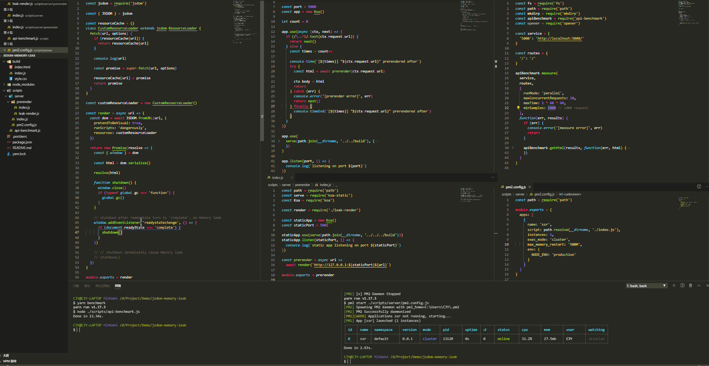

# JSDOM memory leak demo

window.close() called too early cause Memory leak sometimes

## Issues

https://github.com/jsdom/jsdom/issues/2741
https://github.com/jsdom/jsdom/issues/2742

- - -

## Scripts

### **yarn serve**

staring http://localhost:5000 server and supporting debug in chrome://inspect/#devices

### **yarn pm2**

run `yarn serve` with installed global pm2

### **yarn benchmark**

benchmark 1000 times request on api http://localhost:5000

- - -

## Primary Code

```js
const resourceCache = {}
class CustomResourceLoader extends jsdom.ResourceLoader {
  fetch(url, options) {
    if (resourceCache[url]) {
      return resourceCache[url]
    }

    const promise = super.fetch(url, options)

    resourceCache[url] = promise
    return promise
  }
}

const customResourceLoader = new CustomResourceLoader()

const render = async url => {
  const dom = await JSDOM.fromURL(url, {
    pretendToBeVisual: true,
    runScripts: 'dangerously',
    resources: customResourceLoader
  })

  return new Promise(resolve => {
    const { window } = dom

    const html = dom.serialize()

    resolve(html)

    function shutdown() {
      window.close()
    }

    // // shutdown after readyState turn to 'complete', no Memory leak
    // window.addEventListener('readystatechange', () => {
    //   if (document.readyState === 'complete') {
    //     shutdown()
    //   }
    // })

    // shutdown immediately cause Memory leak
    shutdown()
  })
}
```

- - -

## Gif

### no-leak



### leak


### resourceCache

In this demo, `resourceCache` would only hold 3 resource and would never hold more


